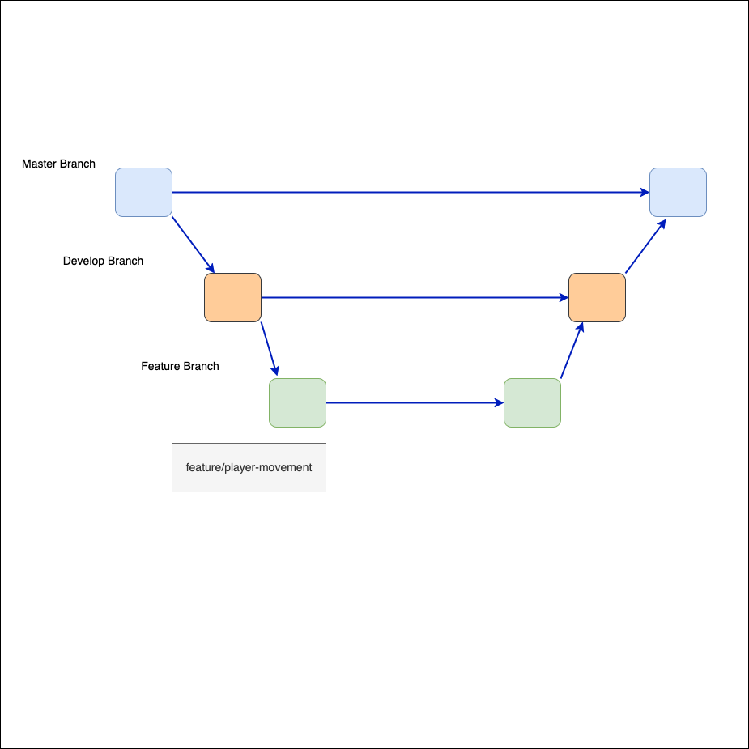

# Island Survivor 🌴

A minimalist 3D survival game created in Unity for a summer class project. You wake up stranded on an island after a plane crash and must gather resources, craft tools, and fend off nighttime creatures to escape.

## 🎮 Gameplay Overview
- Scavenge resources and craft essential survival tools
- Fight off monsters that appear at night
- Repair a broken boat to escape the island and win

## 🧠 Concept
> After waking up stranded and alone on an unknown island, you must scavenge resources, craft tools, and fight creatures that lurk in the darkness. Will you be able to overcome the island and make it home alive?

## 🕹️ Genre & Audience
- **Genre:** Survival, Adventure
- **Target Age:** 10+
- **Rating:** E10+

## ✨ Unique Features
- Unlike Minecraft or Terraria, Island Survivor has a clear end-goal
- Low-poly aesthetic with simple, immersive audio design

## 👨‍💻 Development
- **Engine:** Unity (C#)
- **Team Size:** 2
- **Duration:** 5 weeks
- **Branches:**
  - `main`: stable demo-ready builds
  - `dev`: current working build
  - `feature/*`: individual features (combat, inventory, etc.)

## 🚧 Project Status
- ✅ Week 1: Form team and draft GDD

## 📸 Screenshots / GIFs

## 👨‍💻 For Developers

### 🔀 Branching Strategy

### 📁 How to Run
1. Clone the repo
2. Open in Unity 2022.x+
3. Play the `MainScene`

---

